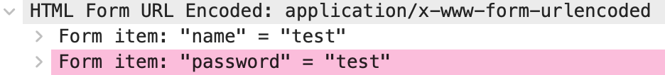

# A simple web app to catch the users log in information using Wireshark

## How to run

1. Clone the repository
2. Run the following command in the terminal
```bash
pip install Flask
python3 main.py
```
3. It is going to display 2 links for our website, we need the one that is not "Running on http://127.0.0.1:8080" (usually the second one)
4. You can start the Wireshark capture now. The filter is 
```
http.request.method == "POST" and http.request.uri contains "/login" and ip.dst == <your_ip>
```
5. When you access the website, you can log in with any username and password. The Wireshark should capture the POST request with the username and password in the body. The example of such request is shown below.



## Credentials

The default credentials are:
```
username: admin
password: admin
```

# License

This project is licensed under the MIT License - see the [LICENSE](LICENSE) file for details